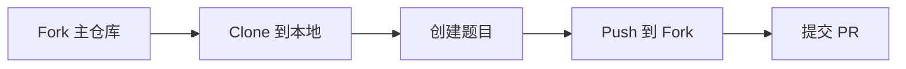

# 2025 FloatCTF 新生赛题目仓库

<challenges>

## Challenges
| 题目名称 | 分类 | 作者 | 描述 |
|---------|------|------|------|
| base64 | Crypto | fb0sh@outlook.com | ZmxhZ3tiMWQxZmNmNy01NzQyLTQ0OTctODYwOC1iZGU1NDlmMWQ1MmV9 |
| caesar | Crypto | myx2727461997@gmail.com | 凯撒大帝的秘密信息！  密文：iordwfwi{fdhvdu_flskhu_lv_hdvb}  提示1：这是最古老的加密方法之一 提示2：凯撒密码的位移量通常在 1-25 之间 提示3：试试往回移动 3 位 |
| png | Misc | fb0sh@outlook.com | 图片里面有什么 |
| easy_reverse | Reverse | ablklice@gmail.com | 使用tea算法进行解密,答案使用flag{}进行包裹 |
| frontend_bypass | Web | ablklice@gmail.com | 前端绕过 |
| backdoor | Web | fb0sh@outlook.com | php backdoor |
| comment | Web | fb0sh@outlook.com | 注释里面有什么？ |
| dir_enum | Web | fb0sh@outlook.com | 想必你一定知道什么是目录扫描吧 |
| learn_http | Web | fb0sh@outlook.com | HTTP Protocol |
| cookie | Web | myx2727461997@gmail.com | 想成为管理员吗？也许你需要一个特殊的饼干！ |
| robots | Web | myx2727461997@gmail.com | 听说搜索引擎的爬虫都会先看 robots.txt 文件？ |

</challenges>

**相关链接**：

- 主仓库：https://github.com/FloatCTF/challenges-202510-freshcup
- 题目模板：https://github.com/FloatCTF/challenge-template
- 平台地址：http://127.0.0.1:9090 （本地测试）

## 快速开始

### 协作流程



1. **Fork 仓库**: 访问 [主仓库](https://github.com/FloatCTF/challenges-202510-freshcup) 点击 Fork
2. **克隆到本地**:
   ```bash
   git clone https://github.com/[你的用户名]/challenges-202510-freshcup.git
   cd challenges-202510-freshcup
   ```
3. **创建题目**: 在对应类别目录下添加题目（参考下方指南）
4. **提交并推送**:
   ```bash
   git add .
   git commit -m "feat: add [category]/[challenge_name]"
   git push origin main
   ```
5. **提交 PR**: 在 GitHub 上创建 Pull Request

### 本地测试

```bash
# 确保平台在 http://127.0.0.1:9090 运行
python import_challenges.py
```

## 出题指南

### 题目目录结构

每个题目必须遵循以下目录结构：

```
[类别]/[题目名]/
├── meta.toml           # 必须：题目配置文件
├── README.md           # 可选：题目说明文档
├── attachment/         # 可选：附件目录
│   └── files...
└── src/                # 可选：Docker 源码（动态题目）
    ├── Dockerfile
    ├── flag.sh
    └── ...
```

**支持的题目类别**：

- `Web` - Web 安全
- `Crypto` - 密码学
- `Misc` - 杂项
- `Pwn` - 二进制漏洞
- `Reverse` - 逆向工程

### meta.toml 配置说明

#### 基本配置（必填）

| 字段            | 类型   | 说明                       | 示例                                                      |
| --------------- | ------ | -------------------------- | --------------------------------------------------------- |
| `name`        | String | 题目名称（与文件夹名一致） | `"web_shell"`                                           |
| `author`      | String | 作者邮箱                   | `"admin@ctf.com"`                                       |
| `category`    | String | 题目类别                   | `"Web"`/`"Crypto"`/`"Misc"`/`"Pwn"`/`"Reverse"` |
| `description` | String | 题目描述                   | `"这是一个 SQL 注入题目"`                               |
| `attachment`  | String | 附件路径（可选）           | `"attachment/source.zip"`                               |

#### [flag] 配置段（必填）

| 字段        | 类型   | 说明                      | 示例                       |
| ----------- | ------ | ------------------------- | -------------------------- |
| `value`   | String | Flag 值（空串=动态 flag） | `"flag{test}"` 或 `""` |
| `env_var` | String | 环境变量名                | `"FLAG"`                 |

#### [docker] 配置段（动态题目必填）

| 字段          | 类型   | 说明            | 示例                           |
| ------------- | ------ | --------------- | ------------------------------ |
| `image_tag` | String | Docker 镜像标签 | `"web_shell:latest"`         |
| `port`      | String | 端口/协议       | `"80/tcp"` 或 `"1337/tcp"` |

### 完整示例

#### 示例 1：静态 Flag 题目

```toml
# Crypto/base64/meta.toml
name = "base64"
author = "admin@ctf.com"
category = "Crypto"
description = "ZmxhZ3tiYXNlNjRfaXNfZnVufQ=="

[flag]
value = "flag{base64_is_fun}"
env_var = "FLAG"
```

#### 示例 2：带附件的题目

```toml
# Misc/stego/meta.toml
name = "stego"
author = "admin@ctf.com"
category = "Misc"
description = "图片里面藏着秘密"

attachment = "attachment/secret.png"

[flag]
value = "flag{hidden_in_image}"
env_var = "FLAG"
```

#### 示例 3：Docker 动态题目

```toml
# Web/sqli/meta.toml
name = "sqli"
author = "admin@ctf.com"
category = "Web"
description = "简单的 SQL 注入"

[flag]
value = ""  # 动态 flag
env_var = "FLAG"

[docker]
image_tag = "sqli:latest"
port = "80/tcp"
```

**Dockerfile 示例**：

```dockerfile
FROM php:5-apache
COPY index.php /var/www/html/
COPY flag.sh /flag.sh
RUN chmod +x /flag.sh
CMD ["sh", "-c", "/flag.sh && apache2-foreground"]
```

**flag.sh 示例**：

```bash
#!/bin/bash
# 动态替换 flag
sed -i "s/flag{test_flag}/$FLAG/" /var/www/html/index.php
# 清理环境变量
export FLAG=not_flag
rm -f /flag.sh
```

### 出题最佳实践

#### DO - 正确做法

- 文件夹名与 `meta.toml` 中的 `name` 保持一致
- 使用小写字母和下划线命名：`web_shell`、`rsa_attack`
- Flag 格式统一：`flag{xxx-xxx-xxx}`
- 动态题目使用 `flag.sh` 替换 flag
- 附件压缩后放在 `attachment/` 目录
- Docker 题目本地测试通过后再提交

#### DON'T - 错误做法

- 在 Dockerfile 中硬编码 flag
- 使用空格或特殊符号命名
- 附件超过 50MB
- 忘记清理环境变量中的 flag
- 提交未测试的代码

### 测试和验证

#### Docker 题目本地测试

```bash
# 构建镜像
cd Web/your_challenge/src
docker build -t test .

# 运行测试
docker run -p 8080:80 -e FLAG="flag{test}" test

# 访问测试
curl http://localhost:8080
```

#### 检查清单

- [ ] 目录结构正确
- [ ] meta.toml 格式正确
- [ ] 题目名称与文件夹名一致
- [ ] 类别正确（Web/Crypto/Misc/Pwn/Reverse）
- [ ] Docker 题目可正常运行（如适用）
- [ ] 附件可正常访问（如适用）
- [ ] 本地导入测试通过

## 常见问题

### 题目开发 FAQ

**Q: 支持多个附件吗？**
A: 仅支持一个附件，多文件请打包成 zip。

**Q: 已有 Docker 镜像怎么办？**
A: 保持目录结构，在 meta.toml 中指定正确的 image_tag 即可。

**Q: 如何修改已导入的题目？**
A: 直接修改后重新运行 `import_challenges.py`，会自动覆盖。

### Git 协作 FAQ

**Q: 如何保持 Fork 仓库与上游同步？**

```bash
git remote add upstream https://github.com/FloatCTF/challenges-202510-freshcup.git
git fetch upstream
git checkout main
git merge upstream/main
git push origin main
```

**Q: PR 模板？**

```markdown
## 题目信息
- 名称：[challenge_name]
- 类别：[Web/Crypto/Misc/Pwn/Reverse]
- 难度：[简单/中等/困难]
- 考察点：[简要描述]

## 检查清单
- [ ] meta.toml 格式正确
- [ ] 本地测试通过
- [ ] Docker 可正常运行（如适用）
```

**Q: 多人合作出题？**
A: 主要负责人 Fork → 添加 collaborators → 共同开发 → 统一提交 PR。
